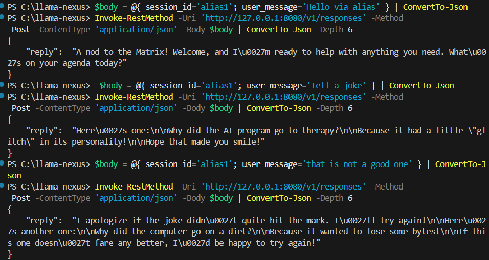
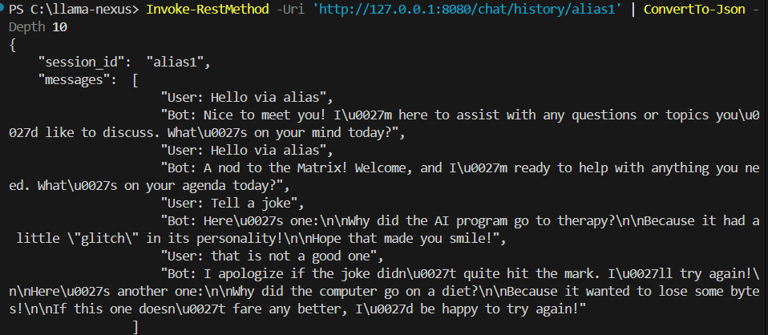
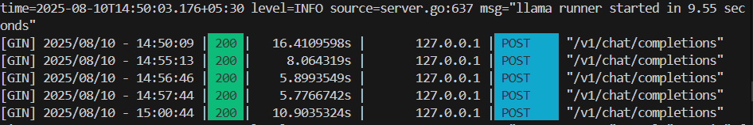
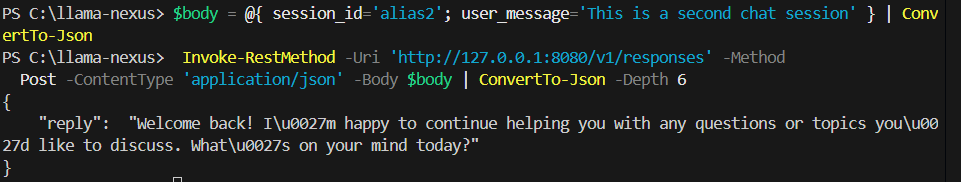
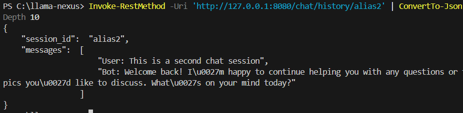
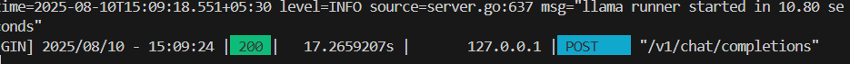
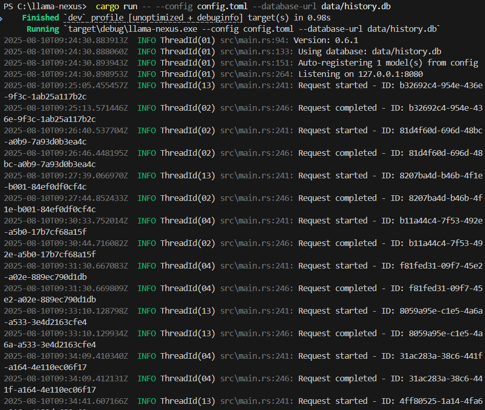

# LFX Pre-test: `/responses` API Implementation in Llama Nexus

This document describes the implementation, setup, and demo of the `/responses` API support added for the LFX mentorship pre-test (WasmEdge Issue [#4286](https://github.com/WasmEdge/WasmEdge/issues/4286)).

## Overview
The `/responses` API constructs a complete **system prompt** and **chat history** inside Llama Nexus for each user request.  
It uses **SQLite** for persistent storage of the history and context for each chat session.

- **LLM Backend**: [Ollama](https://ollama.com/) running a local model (e.g., `llama3`)
- **Database**: SQLite at `/data/history.db`
- **Repo**: [Forked Llama Nexus](https://github.com/ZORDxDD/llama-nexus)

---

## 1. Setup Instructions

### Prerequisites
- Rust installed (`cargo` and `rustc`)
- Ollama installed and running (`ollama serve`)
- SQLite installed (optional, for inspecting DB)
- Model pulled locally (e.g., `ollama pull llama3`)

### Clone and Build
```bash
git clone https://github.com/ZORDxDD/llama-nexus.git
cd llama-nexus
cargo build
```

### Configure

Create or edit `config.toml` (already present). Key parts:

1. Server section: host/port.
2. Models section: auto-register a local Ollama model.
3. (Optional) MCP tool servers: leave disabled for this pre-test.

Example (already in repo):
```toml
[server]
host = "127.0.0.1"
port = 8080

[[models]]
id = "llama3"
kind = "chat"
url = "http://127.0.0.1:11434/v1" # Ollama API
api_key = ""                        # Not needed locally
```

Ensure Ollama is running and model pulled:
```bash
ollama serve &            # or start-service style on Windows
ollama pull llama3
```

### Run

On Windows PowerShell:
```powershell
cargo run -- --config config.toml --database-url data/history.db
```

You should see a log line indicating the model was auto-registered and the server is listening.

### Test `/responses`

PowerShell examples:
```powershell
$body = @{ session_id = 'chat1'; user_message = 'Hello there' } | ConvertTo-Json
Invoke-RestMethod -Uri 'http://127.0.0.1:8080/responses' -Method Post -ContentType 'application/json' -Body $body| ConvertTo-Json -Depth 6

# Follow-up turn (history included automatically):
$body = @{ session_id = 'chat1'; user_message = 'How are you?' } | ConvertTo-Json
Invoke-RestMethod -Uri 'http://127.0.0.1:8080/responses' -Method Post -ContentType 'application/json' -Body $body| ConvertTo-Json -Depth 6

# Fetch history:
Invoke-RestMethod -Uri 'http://127.0.0.1:8080/chat/history/chat1'| ConvertTo-Json -Depth 6
```

## 2. Screenshots / Pictures

Below are captured screenshots illustrating the flow. (Paths relative to repo root.)

### Testing the `/responses` Endpoint With Continuation Of Chat


### Conversation History


### Ollama logs for first chat


### Second chat session


### Second Session Chat History


### Ollama logs for second chat


### Aggregated Server Logs Snapshot



